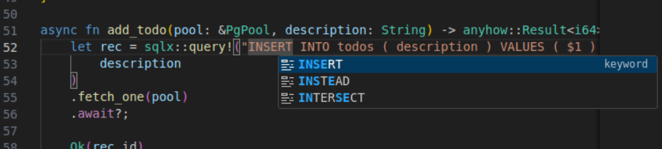

# sqlsurge <!-- omit in toc -->

[sqlsurge](https://marketplace.visualstudio.com/items?itemName=senken.sqlsurge) is a Visual Studio Code extension for SQL language server using [sqls](https://github.com/lighttiger2505/sqls). It works just **NOT ONLY with SQL files, but also with RAW SQL QUERIES on other languages such as TypeScript and Rust**.

Prisma Example in TypeScript:


SQLx Example in Rust:


## Requirements <!-- omit in toc -->

- [**Golang**](https://golang.org/doc/install) v1.22.2 or later
- [**sqls**](https://github.com/sqls-server/sqls?tab=readme-ov-file#installation) v0.2.28 or later
  - There is sqls installation guide in the extension.

## Supported RDBMS <!-- omit in toc -->

See: https://github.com/sqls-server/sqls?tab=readme-ov-file#support-rdbms

## Features <!-- omit in toc -->

These features are available on both Vanilla SQL files and raw SQL queries in other languages(Now only supports [Prisma](https://www.prisma.io/docs/orm/prisma-client/queries/raw-database-access/raw-queries) in TypeScript and [SQLx](https://github.com/launchbadge/sqlx) in Rust).

- [Auto-Completion](#auto-completion)
- [Formatting](#formatting)
- [Quick info symbol](#quick-info-symbol)

### Auto-Completion

These are the auto-completion items sqlsurge provides:

- SQL keywords
- Tables and columns (Required to be configured by `sqls config`)

About raw SQL queries, VSCode's quick suggestion(auto completion) in strings is disabled by default.
It can be enabled by adding the following setting to settings.json.

```json
"editor.quickSuggestions": {
    "strings": true
}
```

### Formatting

VSCode Commands

- SQL File: `Format Document`
- Raw SQL query: `sqlsurge: Format SQL`

Configurations for raw SQL queries

- `sqlsurge.formatOnSave`: Format SQL on save. Default is `true`.
- `sqlsurge.formatSql.indent`: Format SQL with indent. Default is `false`.
- `sqlsurge.formatSql.tabSize`: Tab size for SQL formatting. Default is `4`.

As a formatter, sqlsurge use `sqls` for Vanilla SQL files, use [SQL Formatter](https://github.com/sql-formatter-org/sql-formatter) for raw SQL.

### Quick info symbol

Quick info symbol for tables and columns can be shown by triggering completion with `Ctrl` + `Space` or `Cmd` + `Space`.


## TODOs <!-- omit in toc -->

- [x] Support for Prisma in TypeScript
- [x] Support for SQLx in Rust
- [x] Install guide for sqls
- [x] Format SQL (Vanilla SQL: sqls, Raw SQL: [SQL Formatter](https://github.com/sql-formatter-org/sql-formatter))
- [x] Show quick info symbol
- [ ] Support to custom raw SQL queries, not just Prisma and SQLx
- [ ] Execute SQL query
- [ ] Show sqls config with tree view
